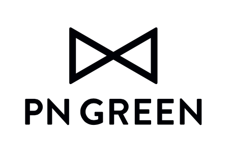

## PN Green is a coffee sourcing company based in Gothenburg, Sweden. 

We trade speciality coffees produced by people we know and trust. Our ambition is to source, import and distribute tasty coffee. We work with an underlying commitment to support long-term relationships, economic stability, environmental awareness, and positive social impact in the communities we source coffee from.

PN Green currently work with farmers and exporters in Nicaragua, Costa Rica, Brazil, Rwanda, Kenya and Ethiopia. We deliver coffee to European roasters who share our values. Our company is founded on the goal to connect producers and roasters who equaly look for stable prices and partnerships. 

Email <a href="mailto:info@pngreen.coffee">info@pngreen.coffee</a> for current offerings, incoming green just to say hi. 
